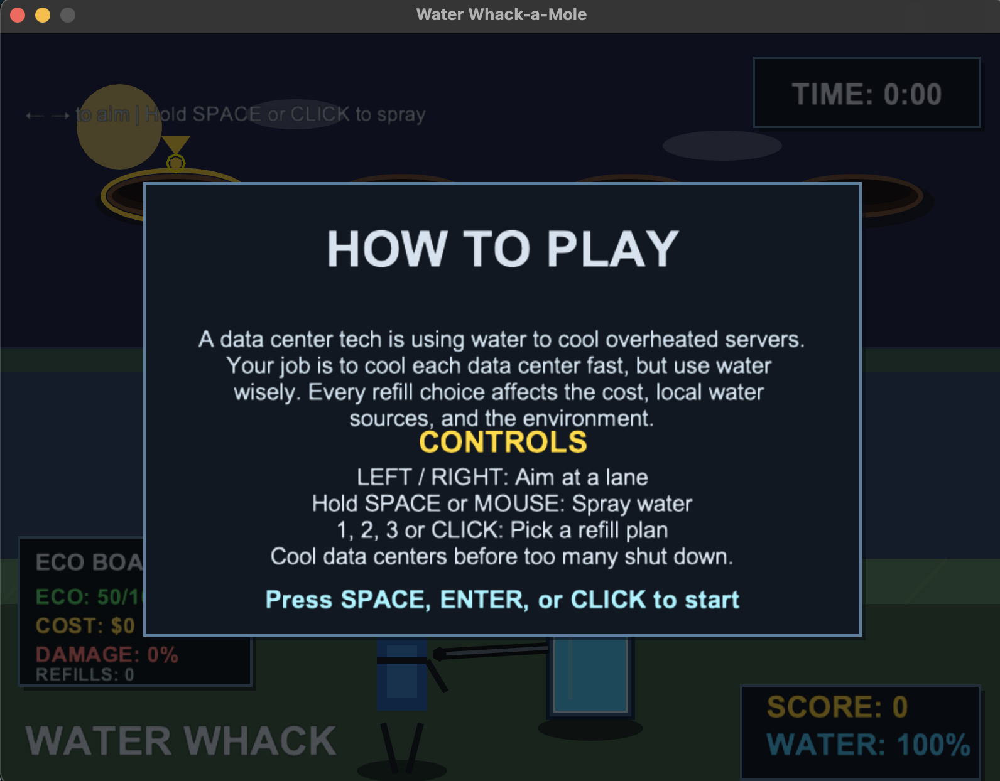
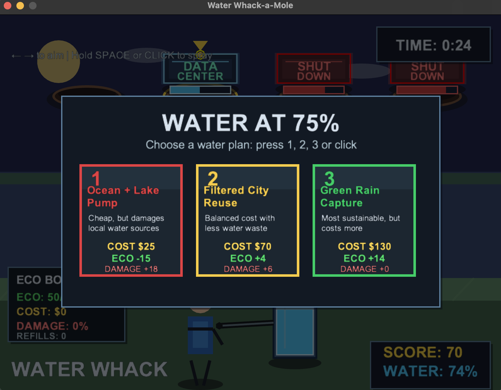
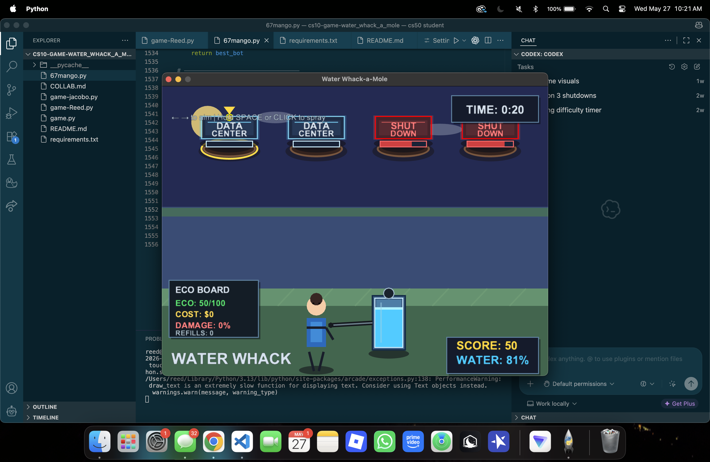

# Water Whack-a-Mole

**Group Members:** Reed and Jacobo

## Description

Water Whack-a-Mole is a whack-a-mole inspired shooter game where players spray water at overheating data centers. It is fast-paced, educational, and built around balancing environmental impact with upgrades and high scores.

## Screenshots

| Gameplay | Challenge | Score |
| --- | --- | --- |
|  |  |  |

## Justifications

On our design doc we had a section for information on the water, but in our game we didn't decided to add that due to the codex bot not understanding, so we decided to pivot to were after you lose 75% of your water you can choose from three options about the water you use.

## How to Install & Play

Simply download the game executable for your operating system and double-click it to play. No installation required!

Mac:
[Download for Mac](https://github.com/reedw2028-rgb/cs10-game-water_whack_a_mole/raw/main/dist/Water%20Whack-a-Mole-mac.zip)

Windows:
Your link here
